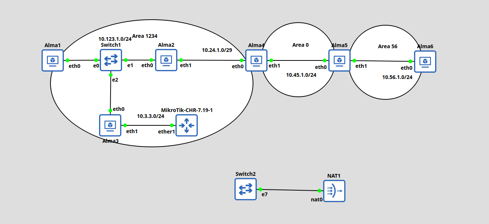

##  OSPF lab with Almalinux VMs in GNS3 (using FRR) and MikroTik CHR 7.19

- Lab Topology:



- In order to set up the almalinux VMs in GNS3:

	- Make sure you have 4 network adapters in GNS3 allocated to the VM

	- Connect the eth3 port from the VM to a switch and to the nat cloud in GNS3 to give internet access to the VMs

	- Use the prepare-os.sh script from this git repository to install all required packages

	- Reboot the VM and start configuring

	- PS: Make sure you install the frr packages from the frr repository, not from Almalinux repository (the above script makes sure that is happening)

- FRR version:

```
alma2# show version 
FRRouting 10.3 (alma2) on Linux(5.14.0-570.17.1.el9_6.x86_64).
Copyright 1996-2005 Kunihiro Ishiguro, et al.
configured with:
    '--build=x86_64-redhat-linux-gnu' '--host=x86_64-redhat-linux-gnu' '--program-prefix=' '--disable-dependency-tracking' '--prefix=/' (...)
```

### OSPF configuration of almalinux routers in the topology:

- For all VMs make sure you enable IP forwarding:

```
echo "net.ipv4.ip_forward = 1" >> /etc/sysctl.conf
sysctl -p
```

- Alma1:

```
alma1# show run
Building configuration...

Current configuration:
!
frr version 10.3
frr defaults traditional
hostname alma1
log syslog informational
no ipv6 forwarding
!
interface eth0
 ip ospf 1 area 1234
exit
!
router ospf 1
 ospf router-id 192.168.1.1
exit
!
end
```

- Alma2:

```
alma2# show running-config 
Building configuration...

Current configuration:
!
frr version 10.3
frr defaults traditional
hostname alma2
log syslog informational
no ipv6 forwarding
!
interface eth0
 ip ospf 1 area 1234
exit
!
interface eth1
 ip ospf 1 area 1234
exit
!
router ospf 1
 ospf router-id 102.168.2.2
exit
!
end
```

- Alma3:

```
alma3# show running-config 
Building configuration...

Current configuration:
!
frr version 10.3
frr defaults traditional
hostname alma3
log syslog informational
no ipv6 forwarding
!
interface eth0
 ip ospf 1 area 1234
exit
!
interface eth1
 ip ospf 1 area 1234
exit
!
router ospf 1
 ospf router-id 192.168.3.3
exit
!
end
```

- Alma4:

```
alma4# show running-config 
Building configuration...

Current configuration:
!
frr version 10.3
frr defaults traditional
hostname alma4
log syslog informational
no ipv6 forwarding
!
interface eth0
 ip ospf 1 area 1234
exit
!
interface eth1
 ip ospf 1 area 0
exit
!
router ospf 1
 ospf router-id 192.168.4.4
exit
!
end
```

- Alma5:

```
alma5# show running-config 
Building configuration...

Current configuration:
!
frr version 10.3
frr defaults traditional
hostname alma5
log syslog informational
no ipv6 forwarding
!
interface eth0
 ip ospf 1 area 0
exit
!
interface eth1
 ip ospf 1 area 56
exit
!
router ospf 1
 ospf router-id 192.168.5.5
exit
!
end
```

- Alma6:

```
alma6# show running-config 
Building configuration...

Current configuration:
!
frr version 10.3
frr defaults traditional
hostname alma6
log syslog informational
no ip forwarding
no ipv6 forwarding
!
interface eth0
 ip ospf 1 area 56
exit
!
router ospf 1
 ospf router-id 192.168.6.6
exit
!
end
```

- MikroTik CHR:

```
/routing ospf instance
add disabled=no name=test router-id=192.168.33.33
/routing ospf area
add area-id=0.0.4.210 disabled=no instance=test name=ospf-area-1
/ip address
add address=10.3.3.2/24 interface=ether1 network=10.3.3.0
/ip dhcp-client
add disabled=yes interface=ether1
/routing ospf interface-template
add area=ospf-area-1 disabled=no interfaces=ether1 priority=1
```

### Pinging alma6 from Mikrotik

```
[admin@MikroTik] > /ping 10.56.1.2
  SEQ HOST                                     SIZE TTL TIME       STATUS                                                             
    0 10.56.1.2                                  56  60 2ms544us  
    1 10.56.1.2                                  56  60 2ms460us  
    2 10.56.1.2                                  56  60 3ms3us    
    3 10.56.1.2                                  56  60 1ms884us  
    sent=4 received=4 packet-loss=0% min-rtt=1ms884us avg-rtt=2ms472us max-rtt=3ms3us 
```

### Pinging Mikrotik from alma6

```
alma6# ping 10.3.3.2
PING 10.3.3.2 (10.3.3.2) 56(84) bytes of data.
64 bytes from 10.3.3.2: icmp_seq=1 ttl=60 time=1.06 ms
64 bytes from 10.3.3.2: icmp_seq=2 ttl=60 time=1.73 ms
64 bytes from 10.3.3.2: icmp_seq=3 ttl=60 time=1.77 ms
64 bytes from 10.3.3.2: icmp_seq=4 ttl=60 time=1.89 ms

--- 10.3.3.2 ping statistics ---
4 packets transmitted, 4 received, 0% packet loss, time 3004ms
rtt min/avg/max/mdev = 1.057/1.612/1.890/0.326 ms
```
