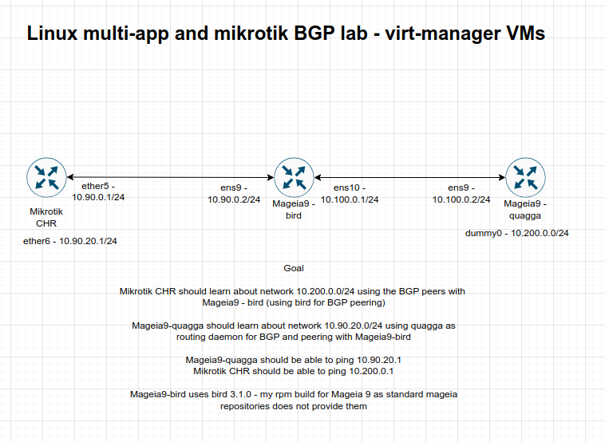

### BGP lab with quagga,bird and mikrotik

- Network topology consist of 3 VMs runing in virt-manager on my PC

- Topology diagram



### Final result

- Mikrotik:

```
[marius@CHR-test-bgp] /routing/bgp/session> /ping 10.200.0.1
  SEQ HOST                                     SIZE TTL TIME       STATUS                                                                                                                                        
    0 10.200.0.1                                 56  63 992us     
    1 10.200.0.1                                 56  63 1ms503us  
    2 10.200.0.1                                 56  63 1ms441us  
    3 10.200.0.1                                 56  63 1ms580us  
    4 10.200.0.1                                 56  63 1ms616us  
    5 10.200.0.1                                 56  63 1ms764us  
    6 10.200.0.1                                 56  63 1ms544us  
    7 10.200.0.1                                 56  63 1ms639us  
    sent=8 received=8 packet-loss=0% min-rtt=992us avg-rtt=1ms509us max-rtt=1ms764us 
```

- Mageia9-quagga:

```
[root@mga9-testbgp ~]# ping 10.90.20.1
PING 10.90.20.1 (10.90.20.1) 56(84) bytes of data.
64 bytes from 10.90.20.1: icmp_seq=1 ttl=63 time=0.797 ms
64 bytes from 10.90.20.1: icmp_seq=2 ttl=63 time=1.55 ms
64 bytes from 10.90.20.1: icmp_seq=3 ttl=63 time=0.836 ms
64 bytes from 10.90.20.1: icmp_seq=4 ttl=63 time=0.678 ms
64 bytes from 10.90.20.1: icmp_seq=5 ttl=63 time=1.70 ms
64 bytes from 10.90.20.1: icmp_seq=6 ttl=63 time=1.34 ms
^C
--- 10.90.20.1 ping statistics ---
6 packets transmitted, 6 received, 0% packet loss, time 5051ms
rtt min/avg/max/mdev = 0.678/1.150/1.699/0.397 ms

```

- As you can see the ping succeed on both sides

### Bird software for Mageia 9

- Bird software for mageia 9 is coming from my rpmbuilds github repository

- For more information please see:

[Github-rpmbuilds](https://github.com/mariusavram123/rpmbuilds)

- Bird version used: 3.1.0 - from the git source code

[Github-bird-source](https://github.com/CZ-NIC/bird)


### Configuration

- Mageia9-quagga:

	- /etc/syctl.conf 
	```
	net.ipv4.ip_forward = 1
	```
	
	- BGPD configuration
	
	```
	!
	hostname bgpd
	password zebra
	enable password zebra
	log stdout
	!
	router bgp 65523
	 bgp router-id 172.16.88.63
	 network 10.100.0.0/24
	 network 10.200.0.0/24
	 neighbor 10.100.0.1 remote-as 65522
	 neighbor 10.100.0.1 interface ens9
	!
	address-family ipv6
	 exit-address-family
	exit
	!
	line vty
	!
	end
	```

- Mageia9-bird:

	- /etc/syctl.conf 
	```
	net.ipv4.ip_forward = 1
	```
	- /etc/bird.conf
	```
	router id 10.100.0.1;
	protocol static {
        ipv4;                   # Again, IPv4 channel with default options
        route 10.90.0.0/24 via 10.90.0.2;
        route 10.100.0.0/24 via 10.100.0.1;
	}
	
	protocol bgp testmarius1 {
       description "My BGP test";
       local 10.90.0.2 as 65522;
       neighbor 10.90.0.1 as 65521;
       hold time 180;           # Default is 240
	   #password "secret";      # Password used for MD5 authentication
       ipv4 {                  # regular IPv4 unicast (1/1)
               #table main;
               import all;
               #import filter rt_import;
               #export all;
               #export filter export_subnets;
               export where source ~ [ RTS_STATIC, RTS_BGP ];
               graceful restart on;
               #export where source ~ [ 10.85.0.0/30, 10.101.101.101/32 ];
       };
	}
	
	protocol bgp testmarius2 {
       description "My BGP test2";
       local 10.100.0.1 as 65522;
       neighbor 10.100.0.2 as 65523;
       hold time 180;           # Default is 240
	   # password "secret";      # Password used for MD5 authentication

       ipv4 {                  # regular IPv4 unicast (1/1)
               #table main;
               import all;
               #import filter rt_import;
               #export all;
               #export filter export_subnets;
               export where source ~ [ RTS_STATIC, RTS_BGP ];
               graceful restart on;
               #export where source ~ [ 10.85.0.0/30, 10.101.101.101/32 ];
       };
	}
	```

- Mikrotik CHR:

	```
	/ip/firewall/address-list> add address=10.90.0.1/24 list=bgp-test
	/ip/firewall/address-list> add address=10.90.20.1/24 list=bgp-test 

	/ip address
	add address=10.90.0.1/24 interface=ether5 network=10.90.0.0
	add address=10.90.20.1/24 interface=ether6 network=10.90.20.0

	/routing bgp connection
	add as=65521 local.role=ebgp name=tomga9 output.network=bgp-test remote.address=10.90.0.2 remote.as=65522

	```

### IP routing tables

- Mikrotik CHR

```
/ip/route> print 
Flags: D - DYNAMIC; I - INACTIVE, A - ACTIVE; c - CONNECT, s - STATIC, b - BGP, d - DHCP
Columns: DST-ADDRESS, GATEWAY, DISTANCE
#     DST-ADDRESS     GATEWAY       DISTANCE
  DAd 0.0.0.0/0       172.16.88.1          1
0  Is 10.45.88.0/24   ovpn-client1         1
  DAc 10.90.0.0/24    ether5               0
  D b 10.90.0.0/24    10.90.0.2           20
  DAc 10.90.20.0/24   ether6               0
  DAb 10.100.0.0/24   10.90.0.2           20
  DAb 10.200.0.0/24   10.90.0.2           20
  DAc 172.16.88.0/24  ether4               0
```

- Mageia9-bird

```
ip route

10.90.0.0/24 dev ens9 proto kernel scope link src 10.90.0.2 
10.90.0.0/24 via 10.90.0.2 dev ens9 proto bird metric 32 
10.90.20.0/24 via 10.90.0.1 dev ens9 proto bird metric 32 
10.100.0.0/24 dev ens10 proto kernel scope link src 10.100.0.1 
10.100.0.0/24 via 10.100.0.1 dev ens10 proto bird metric 32 
10.200.0.0/24 via 10.100.0.2 dev ens10 proto bird metric 32 
```

- Mageia9-quagga

```
ip route

10.90.0.0/24 via 10.100.0.1 dev ens9 proto zebra metric 20 
10.90.20.0/24 via 10.100.0.1 dev ens9 proto zebra metric 20 
10.100.0.0/24 dev ens9 proto kernel scope link src 10.100.0.2 
10.200.0.0/24 dev dummy0 proto kernel scope link src 10.200.0.1 
```

- Mageia9-quagga dummy interface patch so that it can be created on reboot

- /etc/sysconfig/network-scripts/ifup.d/dummy0 

```
#!/bin/bash
ip link add dummy0 type dummy
```

### Ifcfg files - for Mageia 9 VMs

- Mageia9-quagga - all ifcfg-* files are placed into /etc/sysconfig/network-scripts directory

- ifcfg-dummy0

```
DEVICE=dummy0
#TYPE=dummy
BOOTPROTO=static
IPADDR=10.200.0.1
NETMASK=255.255.255.0
MII_NO_SUPPORTED=yes
ACCOUNTING=no
NOZEROCONF=yes
```

- ifcfg-ens9

```
DEVICE=ens9
BOOTPROTO=static
ONBOOT=yes
IPADDR=10.100.0.2
NETMASK=255.255.255.0
ACCOUNTING=no
MII_NOT_SUPPORTED=yes
NOZEROCONF=yes
```

- Mageia9-bird - all ifcfg-* files are placed into /etc/sysconfig/network-scripts directory

- ifcfg-ens9

```
DEVICE=ens9
BOOTPROTO=static
ONBOOT=yes
IPADDR=10.90.0.2
NETMASK=255.255.255.0
MII_NOT_SUPPORTED=yes
ACCOUNTING=no
NOZEROCONF=yes
```

- ifcfg-ens10

```
DEVICE=ens10
BOOTPROTO=static
ONBOOT=yes
IPADDR=10.100.0.1
NETMASK=255.255.255.0
ACCOUNTING=no
MII_NOT_SUPPORTED=yes
NOZEROCONF=yes
```
